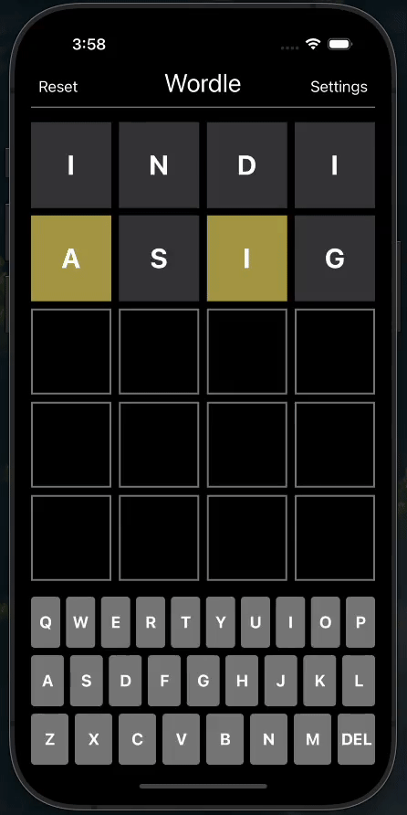

# Wordle 

By: **Ahsan Baseer**

**Wordle** is a word-guessing game, now with new updates. Now, the users can explore various word themes such as animals, countries, or the classic 'normal' theme. They have the flexibility to adjust the number of guesses allowed and the length of the goal word. For those seeking an extra challenge, Wordle introduces an alien mode where the goal word changes with each guess, adding an element of unpredictability. Players can now, reset the game at any point, allowing them to start over.

Time spent: **2** hours spent in total

## Features

The following **required** functionality is completed:

- [X] User can change the number of letters per row (the length of the goal word)
- [X] User can change the numbers of rows on the board (how many guesses allowed)
- [X] User can select a new themed set to pull the goal word from
- [X] User can select "alien wordle", causing the goal word to change after each guess
- [X] App displays a reset button on the top left to reset the game (but make no changes to the settings)

## Video Walkthrough

## License

    Copyright 2024 Ahsan Baseer

    Licensed under the Apache License, Version 2.0 (the "License");
    you may not use this file except in compliance with the License.
    You may obtain a copy of the License at

        http://www.apache.org/licenses/LICENSE-2.0

    Unless required by applicable law or agreed to in writing, software
    distributed under the License is distributed on an "AS IS" BASIS,
    WITHOUT WARRANTIES OR CONDITIONS OF ANY KIND, either express or implied.
    See the License for the specific language governing permissions and
    limitations under the License.
